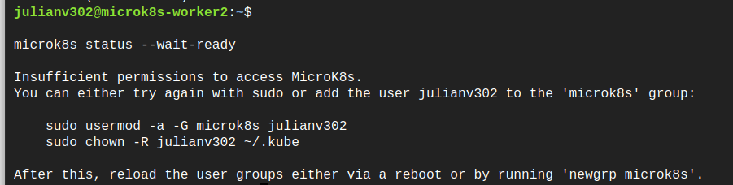

# ST0263 - Tópicos Especiales de Telemática
#
## Integrantes:
- Hobarlan Uparela Arroyo (huparelaa@eafit.edu.co)
- Julian David Valencia Restrepo (jdvalencir@eafit.edu.co)
- Andres Prada Rodriguez (apradar@eafit.edu.co)

## Profesor
- **Nombre:** Edwin Nelson Montoya Munera
- **Correo:** emontoya@eafit.edu.co

# Proyecto 2 – Cluster Kubernetes

## 1. breve descripción de la actividad

En este proyecto, desplegaremos una aplicación wordpress con microk8s. Para este proyecto se utilizó GCP. Allí se crearon el master y los worker para utilizar el software de microk8s. Este software nos permite la creación de cluster propio de kubernetes. También se creo una maquina como servidor NFS para que el wordpress y la base de datos tuvieran persistencia en caso de que algunos de los pods fallen. 

### 1.1. Que aspectos cumplió o desarrolló de la actividad propuesta por el profesor (requerimientos funcionales y no funcionales)

Aspectos cumplidos de la actividad propuesta por el profesor:

* Aplicación wordpress o app seleccionada dockerizada monolítica en con varios pods que mejore la
disponibilidad de esta aplicación. 
* Configuración de services, deployment, pvc y pv para el pod de wordpress.
* Aplicación de base de datos MYSQL en un pod. 
* Servidor NFS que persiste los datos tanto de la DB como del Wordpress.
* Configuración de services, deployment, pvc y pv para el pod de MYSQL. 
* Configuración de ingress para que permita el tráfico para wordpress.
* Certificado SSL. 
* Despliegue correcto con dominio y subdominio propio.

### 1.2. Que aspectos NO cumplió o desarrolló de la actividad propuesta por el profesor (requerimientos funcionales y no funcionales)

* Se cumplieron todos los aspectos del proyecto 2.

## 2. información general de diseño de alto nivel, arquitectura, patrones, mejores prácticas utilizadas.
Se utilizó la arquitectura presentada a continuación:


Como podemos ver en el diagrama se puede acceder a la página web por medio del ingress, aquí se configuro el `https` obteniendo el certificado SSL. Este Ingress nos redirige al servicio de wordpress. Estos pods apuntan a un servicio de la base de datos para hacer el CRUD necesario. También se tiene el NFS para guardar los datos tanto del wordpress como de la base de datos.

## 3. Descripción del ambiente de desarrollo y técnico: lenguaje de programación, librerias, paquetes, etc, con sus numeros de versiones.

Se utilizó el software de microk8s para configurar el cluster. Para crear las maquinas virtuales se utilizó la nube de GCP. Las versiones de las imagenes de wordpress y mysql son estas: 

``` 
- docker.io/bitnami/mysql:8.0

- wordpress
```

Para el NFS se utilizó la versión 4.1

## 4. Descripción del ambiente de EJECUCIÓN (en producción) lenguaje de programación, librerias, paquetes, etc, con sus numeros de versiones.

## IP o nombres de dominio en nube o en la máquina servidor.

Para acceder a la página web se puede hacer por medio de la siguiente dirección: https://proyecto2.teleafit.tech/


La ip externa del nodo master es una ip pública elastica.

## Descripción y como se configura los parámetros del proyecto

### 1. Creación de las maquinas que se utilizarán en el cluster

* Crear la maquina microk8s-master

Dejar todo igual, excepto boot disk: 


Y activar las reglas de firewall:


* Crear dos worker llamados microk8s-worker1 y microk8s-worker2 con las misma configuración que el microk8s-master


### 2. Cuando se tiene esto creado, se debe descargar microk8s en cada una de las maquinas:

seguir el siguiente tutorial hasta el paso 4: 

[Descargar MicroK8s](https://microk8s.io/)

Es posible que durante el paso 2, te salgo un error como esto: 

    

Lo puedes resolver de la siguiente manera:

Ejecuta el primer comando proporciona en la terminal:

```
    sudo usermod -a -G microk8s julianv302
```

Luego, debes crear la carpeta ~/.kube 

```
    sudo mkdir ~/.kube
```

Por último ejecuta el siguiente comando proporciona en la terminal:

```
   sudo chown -R julianv302 ~/.kube
```

**recuerda que esto es un ejemplo, estos comandos no se deben copiar y pegar tal cual puesto que están sujetos a un nombre de usuario en especifico.**

Ahora, es necesario conectar cada uno de los workers al cluster para esto se hace necesario, los siguientes comandos: 

En el master, ejecutar el siguiente comando para obtener un comando de conexión para los worker: 

```
microk8s add-node
```

Te debería salir algo como esto: 

```
From the node you wish to join to this cluster, run the following:
microk8s join 192.168.1.230:25000/92b2db237428470dc4fcfc4ebbd9dc81/2c0cb3284b05

Use the '--worker' flag to join a node as a worker not running the control plane, eg:
microk8s join 192.168.1.230:25000/92b2db237428470dc4fcfc4ebbd9dc81/2c0cb3284b05 --worker

If the node you are adding is not reachable through the default interface you can use one of the following:
microk8s join 192.168.1.230:25000/92b2db237428470dc4fcfc4ebbd9dc81/2c0cb3284b05
microk8s join 10.23.209.1:25000/92b2db237428470dc4fcfc4ebbd9dc81/2c0cb3284b05
microk8s join 172.17.0.1:25000/92b2db237428470dc4fcfc4ebbd9dc81/2c0cb3284b05
```

Debes tomar el primer comando y copiarlo en un worker.

Repetir este comando para otros workers que quieras conectar. 

3. Configurar el **NFS**

Para esto se puede seguir el siguiente tutorial:

[Enlace para crear NFS Client](https://microk8s.io/docs/how-to-nfs)

Lo primero es configurar en una maquina virtual (Creando otra o en un worker, pero esto último no es recomendable) el NFS Server. 


Ahora en el **master del cluster** se debe ejecutar los siguientes comandos: 


En este nodo master también se deben de aplicar los dos siguietnes manifiestos: 

```
# sc-nfs.yaml
---
apiVersion: storage.k8s.io/v1
kind: StorageClass
metadata:
  name: nfs-csi
provisioner: nfs.csi.k8s.io
parameters:
  server: 10.128.0.5
  share: /home/julianv302/nfs
reclaimPolicy: Delete
volumeBindingMode: Immediate
mountOptions:
  - hard
  - nfsvers=4.1
```

```
# pvc-nfs.yaml
---
apiVersion: v1
kind: PersistentVolumeClaim
metadata:
  name: my-pvc
spec:
  storageClassName: nfs-csi
  accessModes: [ReadWriteOnce]
  resources:
    requests:
      storage: 8Gi

``` 

Esto con el fin de configurar lo necesario para los pvc del wordpress y la db.

### 4. Configurar los manifiestos de docker, MYSQL e Ingress

En esta parte deberas crear los archivos para configurar la aplicación como tal. Estos tal y como se encuentran en la carpeta **k8s** se deben crear en el nodo master de nuestro cluster.

#### 4.1 Para MYSQL

* Archivo llamado mysql-pv.yaml

```
apiVersion: v1
kind: PersistentVolume
metadata:
  name: mysql-pv
spec:
  capacity:
    storage: 5Gi
  volumeMode: Filesystem
  accessModes:
    - ReadWriteMany
  persistentVolumeReclaimPolicy: Retain
  storageClassName: nfs-csi
  nfs:
    server: <ip_nfs_server>
    path: <ruta_nfs>
```

**Cambiar <ip_nfs_server> y <ruta_nfs> por tu configuración de NFS**

* Archivo mysql-pvc.yaml

```
apiVersion: v1
kind: PersistentVolumeClaim
metadata:
  name: mysql-pvc
  labels:
    app: mysql
spec:
  accessModes:
    - ReadWriteMany
  storageClassName: nfs-csi
  resources:
    requests:
      storage: 5Gi
```

* Archivo mysql-deployment.yaml

```
apiVersion: apps/v1 
kind: Deployment
metadata:
  name: wordpress-mysql
  labels:
    app: wordpress
spec:
  selector:
    matchLabels:
      app: wordpress
      tier: mysql
  strategy:
    type: Recreate
  template:
    metadata:
      labels:
        app: wordpress
        tier: mysql
    spec:
      containers:
      - name: mysql
        image: docker.io/bitnami/mysql:8.0
        env:
        - name: MYSQL_ROOT_PASSWORD
          value: <contraseña>
        - name: MYSQL_DATABASE
          value: <nombre_db>
        - name: MYSQL_USER
          value: <db_user>
        - name: MYSQL_PASSWORD
          value: <db_password>
        ports:
        - containerPort: 3306
          name: mysql
        volumeMounts:
        - name: mysql-persistent-storage
          mountPath: /var/lib/mysql
      volumes:
      - name: mysql-persistent-storage
        persistentVolumeClaim:
          claimName: mysql-pvc
```

* Archivo mysql-service.yaml (opcional)

```
apiVersion: v1
kind: Service
metadata:
  name: mysql
  labels:
    app: wordpress
spec:
  ports:
    - port: 3306
  selector:
    app: wordpress
    tier: mysql
  clusterIP: None
```

#### 4.2 Configuración del wordpress

* Archivo llamado wp-pv.yaml

```
apiVersion: v1
kind: PersistentVolume
metadata:
  name:  wordpress-pv
spec:
  capacity:
    storage: 5Gi
  volumeMode: Filesystem
  accessModes:
    - ReadWriteMany
  persistentVolumeReclaimPolicy: Retain
  storageClassName: nfs-csi
  nfs:
    server: <ip_nfs_server>
    path: <ruta_nfs>
```

**Cambiar <ip_nfs_server> y <ruta_nfs> por tu configuración de NFS**


* Archivo wp-pvc.yaml

```
apiVersion: v1
kind: PersistentVolumeClaim
metadata:
  name: wordpress-pvc
  labels:
    app: wordpress
spec:
  accessModes:
    - ReadWriteMany
  storageClassName: nfs-csi
  resources:
    requests:
      storage: 5Gi
```

* Archivo wp-deployment.yaml

```
apiVersion: apps/v1
kind: Deployment
metadata:
  name: wordpress
  labels:
    app: wordpress
spec:
  replicas: 2
  selector:
    matchLabels:
      app: wordpress
      tier: frontend
  strategy:
    type: Recreate
  template:
    metadata:
      labels:
        app: wordpress
        tier: frontend
    spec:
      containers:
      - image: wordpress
        name: wordpress
        env:
        - name: WORDPRESS_DB_HOST
          value: <db_host>
        - name: WORDPRESS_DB_PASSWORD
          value: <db_password>
        - name: WORDPRESS_DB_USER
          value: <db_user>
        - name: WORDPRESS_DB_NAME
          value: <db_name>
        - name: WORDPRESS_DEBUG
          value: "1"
        ports:
        - containerPort: 80
          name: wordpress
        volumeMounts:
        - name: wordpress-persistent-storage
          mountPath: /var/www/html
      volumes:
      - name: wordpress-persistent-storage
        persistentVolumeClaim:
          claimName: wordpress-pvc
```

* Archivo wp-service.yaml 
```
apiVersion: v1
kind: Service
metadata:
  name: wordpress
  labels:
    app: wordpress
spec:
  ports:
  - port: 80
  selector:
    app: wordpress
    tier: frontend
```

#### 4.3 Configuración del Ingress

El Ingress es necesario para darle una entrada a nuestro proyecto de wordpress. Más adelante se configurará el certificado SSL.

``` 
apiVersion: networking.k8s.io/v1
kind: Ingress
metadata:
  name: http-ingress
  labels:
    app: wordpress
spec:
  rules:
  - http:
      paths:
      - pathType: Prefix
        path: "/"
        backend:
          service:
            name: wordpress
            port:
              number: 80
``` 

#### 4.4 Aplicar los cambios

Para aplicar toda la configuración debes hacer:

```
kubectl apply -f . 
```

**Verifica que estes parado en la carpeta en la que creaste todos estos archivos.

Con esto deberías poder ver el instalador de wordpress poniendo la ip externa de la maquina master: 


### 5. Configurar el certificado SSL

**Antes de hacer esto, en tu registrador de dominio, debes mapear la ip externa elastica de tu maquina master.**

Para esto se puede seguir el siguiente link: 

[SSL MICROK8S Certificado](https://stackoverflow.com/questions/67430592/how-to-setup-letsencrypt-with-kubernetes-microk8s-using-default-ingress)

Los archivos de configuración se encuentran en la carpeta **ssl** de este proyecto.

Para los estos dos archivos (cluster-issuer-staging.yaml) y (cluster-issuer.yaml) se deben general dos claves .pem. Se pueden generar con el siguiente comando: 

```
openssl genrsa -out letsencrypt-private-key.pem 2048
```

**Ten en cuenta el nombre de la clave para los dos archivos**

Y agregarlas como secreto al cluster: 

```
sudo microk8s kubectl create secret generic letsencrypt-private-key --from-file=letsencrypt-private-key.pem
```

**Otra vez ten en cuenta el nombre de la clave**

* Cluster-issuer-staging.yaml

```
apiVersion: cert-manager.io/v1
kind: ClusterIssuer
metadata:
  name: letsencrypt-staging
spec:
  acme:
#change to your email
    email: <correo>
    server: https://acme-staging-v02.api.letsencrypt.org/directory
    privateKeySecretRef:
      name: letsencrypt-staging
    solvers:
    - http01:
        ingress:
          class: public
```

Este manifiesto lo utilizamos para probar que efectivamente se pueda hacer la petición del certificado.

* Cluster-issuer.yaml

```
apiVersion: cert-manager.io/v1
kind: ClusterIssuer
metadata:
  name: letsencrypt-prod
spec:
  acme:
    # The ACME server URL
    server: https://acme-v02.api.letsencrypt.org/directory
    # Email address used for ACME registration
    email: <correo>
    # Name of a secret used to store the ACME account private key
    privateKeySecretRef:
      name: letsencrypt-private-key
    # Enable the HTTP-01 challenge provider
    solvers:
      - http01:
          ingress:
            class: public
```

Este es el manifiesto de configuración del ssl para producción

Con estos dos manifiestos creados, apliquelos al cluster: 

```
kubectl apply -f cluster-issuer-staging.yaml

kubectl apply -f cluster-issuer.yaml
```

Ahora se debe crear el archivo que hará la petición del certificado para nuestro dominio.

* Ingress-routes.yaml

```
apiVersion: networking.k8s.io/v1
kind: Ingress
metadata:
  name: ingress-routes
  annotations:
    cert-manager.io/cluster-issuer: "letsencrypt-staging"
spec:
  tls:
  - hosts:
#change to your domain
    - <dominio.tld>
    secretName: tls-secret
  rules:
#change to your domain
  - host: <dominio.tld>
    http:
      paths:
      - path: /
        pathType: Prefix
        backend:
          service:
            name: wordpress
            port:
              number: 80

```

Aplique este manfiesto: 

```
 kubectl apply -f ingress-routes.yaml
```

Y verifique que la petición del certificado fue correcta: 

```
sudo microk8s kubectl get certificate
```

**Este proceso toma alrededor de un minuto o dos si en ese tiempo no se paso de Falso a Verdadero, revise su configuración**

Si salio todo correcto, cambia el ingress-routes.yaml:

Cambiamos esta linea: 

```
cert-manager.io/cluster-issuer: "letsencrypt-staging"

``` 

por esta: 

```
cert-manager.io/cluster-issuer: "letsencrypt-prod"

``` 

```
apiVersion: networking.k8s.io/v1
kind: Ingress
metadata:
  name: ingress-routes
  annotations:
    cert-manager.io/cluster-issuer: "letsencrypt-prod"
spec:
  tls:
  - hosts:
#change to your domain
    - <dominio.tld>
    secretName: tls-secret
  rules:
#change to your domain
  - host: <dominio.tld>
    http:
      paths:
      - path: /
        pathType: Prefix
        backend:
          service:
            name: wordpress
            port:
              number: 80

```

Aplique este manfiesto: 

```
 kubectl apply -f ingress-routes.yaml
```

Y verifique que la petición del certificado fue correcta: 

```
sudo microk8s kubectl get certificate
```

Si se realizó correctamente, ya en su página debería poder ver el candadito para el certificado ssl.

:) 

## Resultados o pantallazos 

Mira la prueba de funcionamiento en este link: 

[Funcionamiento del software](https://youtu.be/W3ynZNCSCmw)

Pantallazo de prueba: 


### Referencias

[LetsEncrypt Microk8s](https://stackoverflow.com/questions/67430592/how-to-setup-letsencrypt-with-kubernetes-microk8s-using-default-ingress)

[FoolControl K8s Wordpress](https://foolcontrol.org/?p=3754)

[Microk8s](https://microk8s.io/)

[NFS MicroK8S](https://microk8s.io/docs/how-to-nfs)
